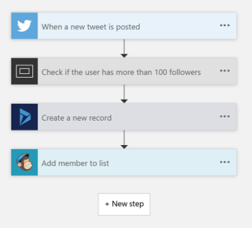
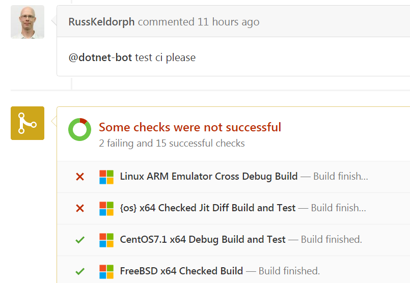

Chain
====

__Chain__ is a framework that allows you automate series of works.<br>
Below example shows how to make a task chain.
```cs
Chain.AddEventSource<Github.CommitEventPublisher>("pjc0247", "RiniDic", "master")
    .Task<Git.Checkout>()
    .Task<MSBuild.Build>()
    .Task<Github.PublishCommitStatus>()
    .Task<Github.NotifyBuildFailure()
```
이외에도 Chain은 단순히 CI 역할뿐만 아니라 웹서버, IoT, 시스템 모니터링등 더 많은 분야에서도 사용할 수 있도록 제작되었습니다.<br>
If you want to find more examples, please click [HERE](https://gist.github.com/pjc0247/d30d3ce1842f099fe32b588869055dbc).

Why I made it
----
그동안 자동화를위한 도구들은 각각의 도메인에 묶여서 통합되지 못한 채, 각각의 서비스들을 사용해야 했습니다.<br>
* __빌드__ : Jenkins
* __채팅 봇 만들기__ : 각각의 서비스에 따라 다른 봇 프레임워크를 통해 제작
* __알림 서비스__ : 직접 폴링하거나, 서비스에서 제공하는 웹훅을 사용하거나

<br>
__Chain__ is inspired by Microsoft's __Flow__.<br>
Just connect each pre-programmed tasks like a Lego block and __Chain__ will exeucte it automatically.
<br>


EventSource
----
__이벤트 소스__는 작업의 트리거가 되는 서비스입니다.<br>
이벤트 소스가 이벤트를 발생시키면, 해당 이벤트에 연결된 작업들이 순차적으로 실행되게 됩니다.<br>
<br>
__Example list of eventSource__
* New commit pushed to Github
* New issue from Github
* Someone sent a message to Slack channel
* HTTP Request
* Detect changes from filesystem

Task
----
Task는 작업의 단위로, 이벤트 소스로부터 전달받은 데이터를 가공하거나, 프로젝트를 빌드, 이전 태스크들의 실행 결과를 유저에게 알리는 역할을 합니다.

__Example list of tasks__
* MSBuild.Build
* AWS.S3.Upload
* AWS.EC2.LaunchInstance
* AWS.CodeDeploy.Deploy
* Jenkins.RequestBuild
* Email.SendMail
* KakaoTalk.SendMessage

Work Context
----
__작업 콘텍스트__는 이전 작업들로부터 실행 결과를 가져오고, 이후에 실행될 작업들을 위해 이번 작업의 실행 결과를 저장하는 역할을 합니다.<br>
<br>
__Abstracted results_<br>
```cs
class LocalCopy
{
    public string Path;
}
class BuildResult
{
    LocalCopy Copy;
    public bool Success;
}
```
__작업 결과 설정하기 / 가져오기__<br>
```cs
/* Git.CheckoutTask */
public override void OnExecute() {
    Context.Set(new LocalCopy() {
        Path = "SOME_PATH"
    });
}
```
```cs
/* MSBuild.Build */
public override void OnExecute() {
    var localCopy = Context.Get<LocalCopy>();

    /* LocalCopy의 데이터를 기반으로 빌드를 수행 */
}
```
작업 결과는 `Set`을 수행할 때 마다 콘텍스트에 누적되며, `GetAll`을 이용해 특정 타입의 모든 작업 결과를 가져올 수 있습니다.
```cs
foreach (var localCopy in Context.GetAll<LocalCopy>()) {
    // 여러개의 로컬 카피에 대해 빌드 수행
}
```

__Dependency__<br>
```cs
public override void OnExecute() {
    Require<LocalCopy>();
}
```

__작업 결과를 IN 파라미터로 변환하기__<br>
```cs
[Ev2Param(typeof(LocalCopy))]
public void OnLocalCopy(LocalCopy ev) {
    Path = ev.Path;
}
``` 
